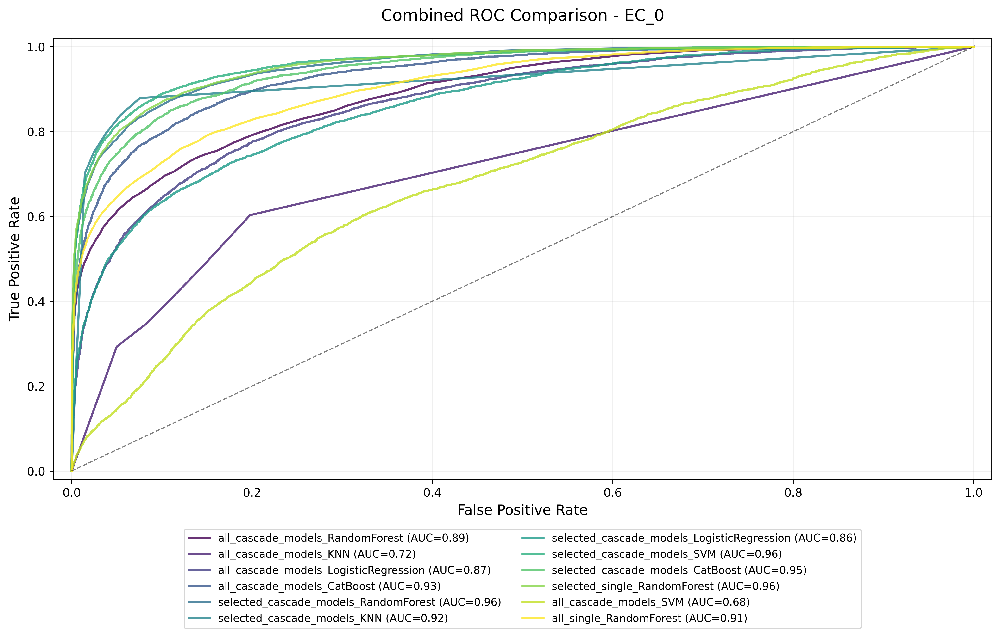
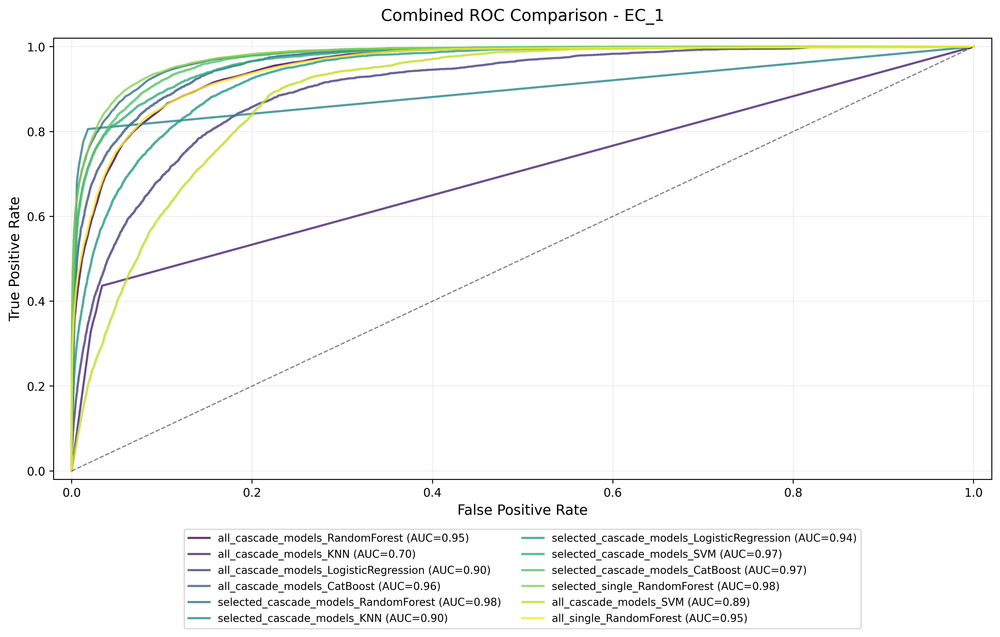
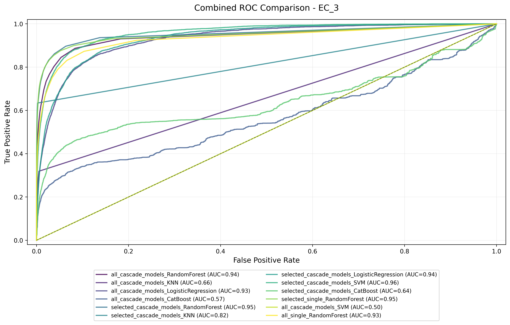

# EC Prediction

## Diamond Benchmark

This project use DIAMOND tool as benchmark. The pipeline utilizes UniRef90 as the reference database and processes protein sequences to generate alignment results.

### Instructions

Goto `dimond.ipynb`, follow all the instructions
+ You may have to download several python packages to set everything up.
+ All code in there is written in `linux`. For different OS, you may need to rewrite some command
+ The output is already generated in `/metrics` and `/dataset/diamond_results`, you may not have to run it again

### File Information

Some files are too large to be included in this repository, but you can generate them yourself following the steps above:

`dataset` : storing all data, including training, test and database sequences
- `diamond_db`: The DIAMOND database folder. (create script in `experiments/dimond.ipynb`)
   - `uniref90.fasta.gz` : original UniRef90 data zip
   - `uniref90.dmnd` : The UniRef90 database for DIAMOND to align
- `ec40` : All the ec40 original data
   - including `.pkl`, `.csv` and `.fasta` formats
- `diamond_results`: Storing the original test sequence and intermidiate processed files
   - `cdhit04_uniprot_sprot_2016_07.pkl`: Cdhit cluster result from UDSMProt
   - Rest are intermidiate files from running DIAMOND

`metrics` : Containing methods' statisitical metrics

   - `metrics.csv` : DIAMOND benchmark report

`experiments`: All methods and utils
   - `dimond` : DIMOND execution file, can be download in `dimond.ipynb` (for linux)
   - `dimond.ipynb` : Pipeline for DIAMOND benchmark (All stage included, no need to download any data your self!)
   - `evaluate_ec.py` : Evaluation util to compare predicted EC numbers and true EC numbers, then generate stats report
   - `fetch_ec_improved` and `fetch_ec` : Fetch utils to get EC numbers from DIAMOND results. Improved version implemented async stages to run fetch simultaneously.
   - `constants`: some global constants

`abstracts`: abstract implementation for Dataloader, FeatureEngineer and Predictor.

`Diamond`: Diamond version of Feature engineer and Predictor

## Machine Learning Modeling
- See `experiments/pipeline.ipynb`
### Feature Generation

+ PSSM Features:

   + for each input sequence:
      + Parse the diamond outputs to get all sequence hits for the input which score less than 1x10^-5 (a typically good BLAST hit cut-off).
      + Then put all the hit sequences in a temp fasta file.
      + Create a temporary blast search database by running the makeblastdb tool over the temp fasta file.
      + Then run PSI-BLAST using the input sequence as the input, the db you just created as the search db and set it to run 1 iteration and to output the PSSM ($m \times 42$ for each sequence). 
      + All instructions are included in `experiments/PSSM/pssm_gen_diamond.ipynb`

+ HMM Features 
   + Download `Hmmer` and `Pfam-A.hmm` database
   + Run `Hmmer` scan through pfam 
   + Take best (lowest) E-value, best (highest) bit score, total coverage and number of domains as final features
   + All instructions are included in `experiments/HMM/HMM_gen.ipynb`

### Feature engineering
- See `experiments/merge_features.ipynb`
#### 1. Data Loading and Initial Preprocessing

- **Data Import:**  
  - Load physiochemical feature results from a CSV file.
  - Import the training, validation, and test sets from the EC40 dataset (CSV files).

- **String Parsing and EC Vector Encoding:**  
  - Use the `encode_ec_vector` function to process the `ec` column. This function:
    - Checks if the input is a string and attempts to parse it with `ast.literal_eval`.
    - If parsing yields a list, the first element is taken; otherwise, the string is split using the period `.` delimiter.
    - Each split segment is cleaned: if the segment is '-' or empty, it is converted to -1; otherwise, it attempts to convert the segment to an integer or float.

- **List Data Conversion:**  
  - Convert string representations of lists in the `AAC` and `DC` columns to actual Python lists using the `convert_str_to_list` function.

- **Column Expansion:**  
  - Apply the `expand_column` function to the columns containing list data (`ec`, `AAC`, and `DC`) to expand them into multiple separate columns. Each new column is named in the format `original_column_index`. The original columns can be optionally dropped.

#### 2. Feature Integration

- **HMM Feature Merging:**  
  - Load HMM feature CSV files for the training, validation, and test sets from the `../dataset/HMM/` directory.
  - Merge these HMM features with the EC40 dataset using the `merge_hmm` function, which performs a left join based on the `accession` and `query_name` fields, filling any missing values with 0.

- **Peptide Features Integration:**  
  - Read peptide sequence features from the `../dataset/peptides/seq_feats.csv` file.
  - Preprocess the peptide features by:
    - Dropping redundant columns.
    - Converting the string-encoded `data` column into Python objects using `eval` and extracting the embedded dictionary.
    - Expanding the dictionary into separate columns and removing duplicates based on `accession`.
  - Merge the processed peptide features with the training, validation, and test datasets.

#### 3. PSSM Feature Processing

- **Loading and Matrix Size Assessment:**  
  - Load PSSM features for the training, validation, and test sets from pickle files.
  - Use the `get_min_m` function to determine the range of matrix row counts (representing sequence lengths) for each dataset.

- **Matrix Truncation and Flattening:**  
  - Define the `truncate_and_flatten` function to convert PSSM matrices into fixed-size representations:
    - If the matrix has fewer rows than the target (32 rows), pad it with zeros.
    - If it exceeds the target, truncate the matrix to the target number of rows.
    - Flatten the resulting fixed-size (32x42) matrix into a one-dimensional vector.
  - Apply this function to each PSSM matrix in the training, validation, and test sets, and construct new DataFrames where each column is named `pssm_i` (with `i` being the vector index).
  - Merge these new PSSM features back into the corresponding datasets.

#### 4. Final Dataset Preparation

- **Dropping Redundant Columns:**  
  - Remove unnecessary columns from the training, validation, and test datasets (e.g., `Original`, `traintest`, `negative_for`, `mainclass_set`, `sprot_version`, `len`, `cluster_ID`, `representative`, `sequence`, `accession`, and `query_name`) to finalize the feature matrix for model input.
- Apply `MinMaxScaler` to scale all features

### Feature Selection
- See `experiments/feature_selection.py`
#### 1. Data Preparation and Scaling

- **Loading Data:**  
  The training, validation, and test datasets are loaded from pickle files.
  
- **Feature-Label Separation:**  
  The dataset columns starting with `'ec_'` are treated as the labels, while the remaining columns form the feature set.
  
- **Scaling:**  
  Features are scaled using a `MinMaxScaler` to normalize the data, which helps the subsequent feature selection methods work more effectively.

#### 2. Variance Filtering

- **Purpose:**  
  Remove features with very low variance, which are unlikely to be informative for the prediction task.
  
- **Implementation:**  
  A `VarianceThreshold` with a threshold of 0.01 is applied to the combined training and validation data.  
  This step results in a subset of features that have sufficient variation across samples.

#### 3. Multi-output Feature Selection via Mutual Information

- **Purpose:**  
  Evaluate the relevance of each feature with respect to each output (i.e., each column in the multi-label target) and aggregate their importance.
  
- **Implementation:**  
  - For each label, mutual information scores are computed using `mutual_info_classif`.
  - The scores for each feature are summed across all labels.
  - The top features are then selected (with a maximum of 500 features) based on the aggregated scores.
  
- **Outcome:**  
  This step yields a reduced set of features that are most informative for the multi-label task.

#### 4. Final Feature Selection with RFECV

- **Purpose:**  
  Refine the feature subset further using Recursive Feature Elimination with Cross-Validation (RFECV) to find the optimal number of features.
  
- **Implementation:**  
  - A `RandomForestClassifier` serves as the estimator within RFECV.
  - The RFECV process uses a custom scorer based on the micro-averaged F1 score, which is suitable for multi-label classification.
  - The cross-validation is performed using a `PredefinedSplit`, which distinguishes between training and validation samples.
  - The elimination process proceeds in steps (removing 5 features per iteration) until the optimal feature subset is identified.
  
- **Outcome:**  
  The optimal feature indices are determined and saved, along with the grid scores from the RFECV process, for further use in model training.

### Model Training
- See `experiments/model_selection.py`

#### 1. Data Loading and Preprocessing

- **Data Import and Preparation:**  
  - The training, validation, and test datasets are loaded from pickle files.
  - Features and labels are separated, where columns starting with `'ec_'` are used as labels and all other columns as features.
  - The feature set is filtered using a previously selected set of indices, and the data is normalized with a `MinMaxScaler`.

- **Training-Validation Split:**  
  - The training and validation datasets are concatenated to form a combined training set.
  - A `PredefinedSplit` is created to designate which samples are for training and which for validation.

#### 2. Cascade Model Training

- **Cascade Structure:**  
  - A cascade model is built for each candidate classifier. In this process, a model is trained for each output label sequentially.
  - For each label:
    - The model is trained only on samples with valid labels (ignoring any placeholder values such as `-1`).
    - After training, the model predicts the label for the entire dataset.
    - These predictions are appended as new features for subsequent cascade steps, thus enriching the feature set with inter-output information.

#### 3. Candidate Models

For comparison purpose, we applied a Random Forest to perform multi-class classification and record all metrics

The following candidate models are used in the cascade training process:

- **K-Nearest Neighbors (KNN)**
- **Logistic Regression**
- **Random Forest**  
  Uses 200 trees and no maximum depth, ensuring robust performance.
- **CatBoost Classifier**  
  Configured with 200 iterations and set to silent mode for training.
- **Support Vector Machine (SVM)**  
  Uses probability estimates to better integrate with the cascade structure.

Each candidate model is cloned and trained within the cascade framework to handle the multi-label task.

#### 4. Saving and Reproducibility

- **Model Saving:**  
  - Once trained, the cascade models for each candidate are saved to disk as pickle files in the designated `Selected_Feature_Models` directory.
  - This ensures that the models can be later loaded for prediction or further analysis without needing to retrain them.

### Model Evaluation

- See `experiments/feature_selection.py` and `experiments/pipeline.ipynb`

#### 1. Directory Organization

Before starting the evaluation, the script ensures that all necessary directories exist. This includes:

- **Models Folder:**  
  The folder `Selected_Feature_Models` contains the saved cascade models.

- **Results Base Folder:**  
  A main folder (e.g., `../metrics`) is created along with subfolders for:
  - **Confusion Matrices:** Where the confusion matrix plots for each output and model are saved.
  - **ROC Curves:** Where the ROC curve plots for each output and model are saved.
  - **Evaluation Reports:** Where CSV reports summarizing model performance are stored.

#### 2. Loading and Preparing Model Data

- **Loading ROC Data:**  
  Previously saved ROC comparison data (e.g., from `roc_comparison_data.pkl`) is loaded to support cross-model ROC analysis.

- **Model File Processing:**  
  The script iterates through all the model pickle files in the models folder. For each model file:
  - A model-specific subfolder is created in both the confusion matrix and ROC curves directories.
  - The saved cascade models for the candidate are loaded from disk.

#### 3. Cascade Prediction

For each candidate model:
  
- **Feature Propagation:**  
  The evaluation begins with the test feature set. For every step (i.e., for each output label in the cascade), the model:
  - Generates probability predictions using `predict_proba`.  
    If the method is not available, it falls back to a default probability matrix.
  - Makes a label prediction using `predict`.
  - Appends the predictions as new features for the next cascade step.
  
- **Final Prediction Matrix:**  
  After iterating through all cascade steps, the individual predictions are combined into a full prediction matrix (with one column per output label).

#### 4. Evaluation Metrics Calculation

- **Evaluation Report Generation:**  
  The custom function `evaluate_ec_predictions` is used to compute various performance metrics, including:
  - **Exact Match Accuracy:** The proportion of samples for which all predicted labels match the true labels.
  - **No EC Number Found / No Prediction Ratio:** The fraction of samples where no valid prediction is made.
  - **Per-Position Metrics:** For each output position, accuracy, precision, recall, and F1-score are computed (ignoring invalid labels).

- **Report Saving:**  
  The evaluation report for each model is saved as a CSV file in the evaluation reports folder. An aggregated report is also maintained by concatenating the results from each model.

#### 5. Confusion Matrix Plotting

For every output position in the model’s predictions:
  
- **Data Filtering:**  
  The true and predicted labels are filtered to exclude invalid labels (indicated by `-1`).
  
- **Matrix Calculation and Normalization:**  
  A confusion matrix is computed using the filtered labels. The matrix is then normalized by row sums to facilitate comparison across classes.
  
- **Visualization:**  
  The normalized confusion matrix is plotted using a heatmap with dynamic sizing based on the number of unique classes.  
  The generated plots are saved to the model-specific confusion matrix folder.

#### 6. ROC Curve Plotting

For each output position:
  
- **Probability Processing:**  
  The evaluation extracts the probability estimates for the positive class from the stored probability matrices.  
  The true labels are binarized and filtered to ensure sufficient valid samples.
  
- **ROC Calculation:**  
  The micro-average ROC is computed (using `roc_curve` and `auc`), and the resulting false positive rates, true positive rates, and AUC scores are calculated.
  
- **Plotting and Comparison:**  
  Individual ROC curves for each output are plotted and saved in the model-specific ROC folder.  
  Additionally, the ROC data for each model is aggregated in the comparison data structure to facilitate cross-model comparisons.

